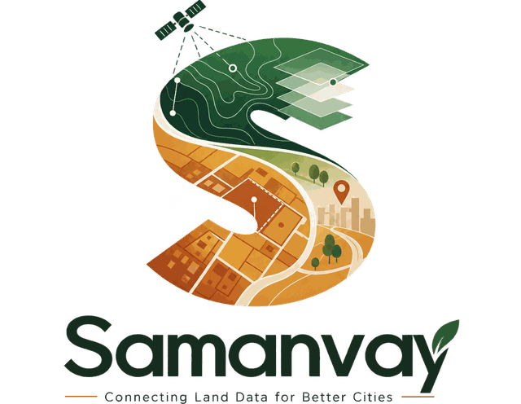
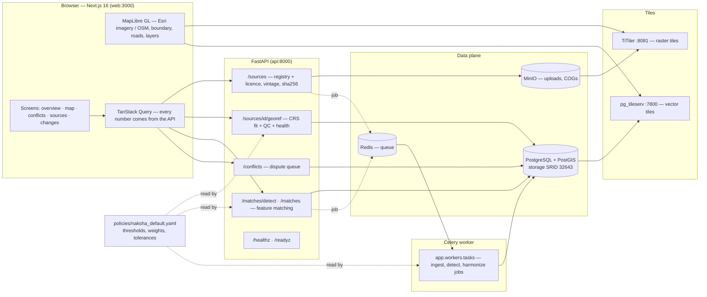
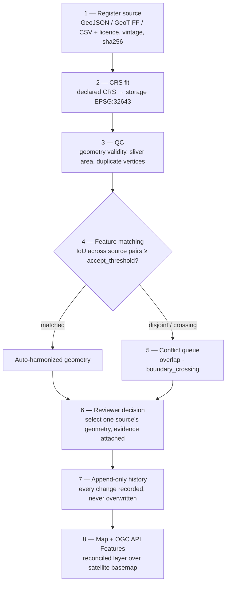

# Samanvay (समन्वय)

<p align="center">
  
</p>

A harmonization engine and reviewer workbench for multi-source urban land records.

**Problem:** Smart India Hackathon 2026, problem statement 26013 — *Automated Integration and
Intelligent Harmonization of Multi-source Geospatial Data for Urban Land Record Management*
(Ministry of Rural Development, Department of Land Resources, NAKSHA programme).

Samanvay aligns drone-derived, AI-extracted, cadastral, revenue, municipal, utility and GNSS
layers over one coordinate frame, matches features across them, applies the NAKSHA three-tier
reconciliation policy, scores every output with an explainable confidence, and hands what it
cannot settle to a human with the evidence attached — as a risk-ranked field-verification queue
and a reconciled layer exposed through OGC API Features.

This repository is a **hackathon prototype**. It is not an official DoLR, Survey of India or
NAKSHA system, it does not determine legal title, and it does not issue ULPINs.

## Specifications

Read these before writing or reviewing code:

| File | Contents |
|---|---|
| `docs/research.md` | What the problem really is, verified facts, what to build and not build |
| `docs/backend.md` | Architecture, data model, algorithms, policy, API |
| `docs/front.md` | Screens, components, data contracts |
| `docs/design.md` | Design system, tokens, anti-vibe-coding rules |
| `docs/datasets.md` | Data sources, licences, evaluation experiments |
| `docs/final-prompt.md` | The staged delivery plan this repo follows |

Progress notes per stage live in `docs/stage-N.md`.

## Stack

- **Backend:** Python 3.12, FastAPI, Pydantic v2, PostgreSQL + PostGIS, Celery + Redis, MinIO,
  Alembic, pytest + hypothesis.
- **Frontend:** Next.js 16 (App Router), TypeScript strict, Tailwind v4 driven by CSS variables
  from `docs/design.md`, TanStack Query, MapLibre GL JS (satellite + OSM basemaps).
- **Services:** TiTiler (COG tiles), pg_tileserv (vector tiles from PostGIS).
- **Everything:** Docker Compose.

## Architecture



## Workflow



## Running it

```bash
cp .env.example .env          # only needed if you want to override defaults
docker compose up --build -d
docker compose exec api alembic upgrade head
```

| Service | URL |
|---|---|
| Web | http://localhost:3000 |
| API | http://localhost:8000 |
| API reference | http://localhost:8000/docs |
| TiTiler | http://localhost:8081 |
| pg_tileserv | http://localhost:7800 |
| MinIO console | http://localhost:9001 |

Health: `GET /healthz` (liveness) and `GET /readyz` (PostGIS, Redis, MinIO and policy readiness).

## Working locally without Docker

```bash
# backend
cd backend
uv venv .venv --python 3.12
uv pip install -e ".[dev]"
.venv/Scripts/ruff check . && .venv/Scripts/ruff format --check .
.venv/Scripts/mypy app
.venv/Scripts/pytest

# web
cd web
npm ci
npm run lint && npm run typecheck && npm test && npm run build
```

## Rules that do not bend

1. Never fabricate data, metrics, users, testimonials or results. Synthetic data carries
   `is_synthetic = true` and a visible `SYNTHETIC` label.
2. Never invent geometry. Resolution selects one source's actual geometry or sends the case to a
   human. Boundaries are never averaged.
3. Automated repairs are bounded, logged and refusable.
4. No claim of legal title determination or official ULPIN issuance.
5. Owner personal data stays out of feature and OGC APIs and is reached only through a
   purpose-bound, audit-logged endpoint.
6. Confidence weights, thresholds and tolerances live in `policies/naksha_default.yaml`, not in
   code, and every one of them is a starting heuristic.
